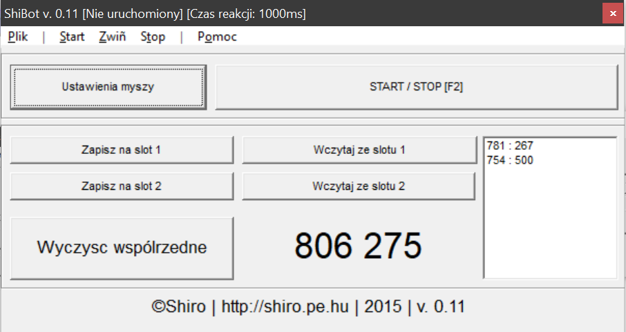

# Shibot

It's clicker bot. You can provide coordinates and intervals and application will make clicks for you. 

- You can set coordinates by click `TAB` 
- Also you can set time b/w clicks and if it should works in loop by click `ustawienia myszy`
- To toggle application click `F2`
- You can lift the application and clean coordinates

&copy;2015 Hryszko Simon! 
